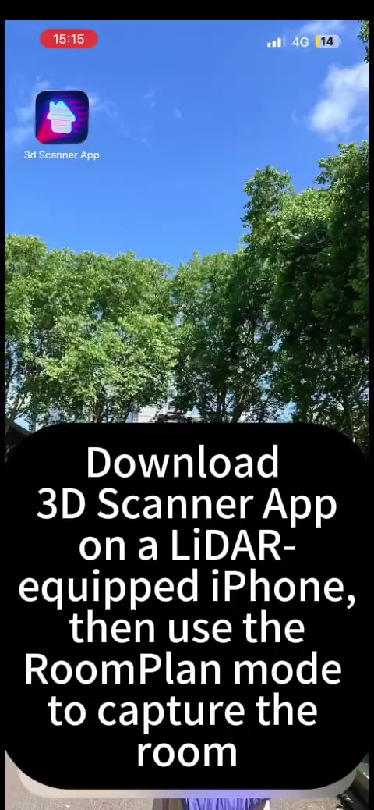

<h1 align="center">
  
  LiteReality: Graphics-Ready 3D Scene Reconstruction from RGB-D Scans
</h1>

<p align="center">
  <b>NeurIPS 2025</b>
</p>

<p align="center">
  <a href="https://arxiv.org/abs/2507.02861"></a>
  <a href="https://litereality.github.io"></a>
  <a href="https://www.youtube.com/watch?v=ecK9m3LXg2c&feature=youtu.be"></a>
</p>


<p align="center">
  <b><a href="https://zheninghuang.github.io/">Zhening Huang</a></b><sup>1</sup>,
  <b><a href="https://xywu.me">Xiaoyang Wu</a></b><sup>2</sup>,
  <b><a href="https://www.cl.cam.ac.uk/~fz261/">Fangcheng Zhong</a></b><sup>1</sup>,
  <b><a href="https://hszhao.github.io">Hengshuang Zhao</a></b><sup>2</sup>,
  <b><a href="https://www.niessnerlab.org/index.html">Matthias Nießner</a></b><sup>3</sup>,
  <b><a href="https://www.eng.cam.ac.uk/profiles/jl221">Joan Lasenby</a></b><sup>1</sup>
</p>
<p align="center">
  <sup>1</sup>University of Cambridge &nbsp; <sup>2</sup>The University of Hong Kong &nbsp; <sup>3</sup>Technical University of Munich
</p>


## 📢 News

- **[2026-01-19]** LiteReality code is out! Test it with the example scans ([Instruction](#2-download-example-scans), [results visualization](#results-on-example-scans)), or [your own scans](#test-on-your-own-scans)! 
- **[2025-09-18]** LiteReality has been accepted at NeurIPS 2025!
- **[2025-07-03]** Our paper is now available on [arXiv](https://arxiv.org/abs/2507.02861)! Check out the [video demo](https://www.youtube.com/watch?v=ecK9m3LXg2c).

--- 

## 🎬 Results on Example Scans
We tested this codebase with several example scans; here are some of the results (Left:RGB, Right:LiteReality Reconstruction). Click on any thumbnail to watch the full video.
|  Girton Study Room | Darwin BedRoom | CUED BoardRoom |
|-------------|---------|---------|
| [](https://www.youtube.com/watch?v=pD06w2lUZZM) | [](https://www.youtube.com/watch?v=fXzUqLkk2FQ) | [](https://www.youtube.com/watch?v=Ku8fVaQy-8I) |
| Girton Study Room 2 | Girton Common Room | SigProc Tea Room |
| [](https://www.youtube.com/watch?v=8RuTVrQ_oMI) | [](https://www.youtube.com/watch?v=obAVOYMZBSI) | [](https://www.youtube.com/watch?v=IJguTZLKZAE) |

---

## 🛠 Prerequisites

- Linux machine
- Conda
- NVIDIA RTX-enabled GPU (≥ 24 GB VRAM)
- CUDA 12.x or 11.x

## ⚙️ Installation

### 1. Create Conda Environment
```bash
git clone https://github.com/LiteReality/LiteReality.git
cd LiteReality

conda create -n litereality python=3.9 -y
conda activate litereality

pip install torch torchvision torchaudio --index-url https://download.pytorch.org/whl/cu124
pip install -e .
```

### 2. Install GroundingDINO

> **Note:** The GroundingDINO code in this repository includes patches for compatibility with PyTorch 2.5.1+ and CUDA 12.4.

```bash
cd third_party
git clone https://github.com/IDEA-Research/GroundingDINO.git
cp litereality/utils/setup_grounding_dino.py GroundingDINO/setup.py # replace setup.py with this file for easy installation

cd GroundingDINO

# Install dependencies
pip install -r requirements.txt
conda install -c conda-forge gcc=13 gxx=13 -y
pip install -e . --no-build-isolation
cd ../..
```

> If issues persist, please refer to the official [GroundingDINO](https://github.com/IDEA-Research/GroundingDINO) repository.

### 3. Download Pretrained Weights

This script downloads weights for CLIP, DinoV2, Qwen-VL-8B-Instruct, and SAM.

```bash
python litereality/utils/download_pretrained_weights.py
```

### 4. Install Blender

```bash
bash litereality/utils/install_blender.sh
```

---

## 📊 Data Preparation

### 1. Download Material Database

This downloads and extracts the material database (~200 GB) to `./litereality_database/`.

```bash
python litereality/utils/litereality_database_download.py
cp -r asset/pbr_annotations/* litereality_database/PBR_materials/material_lib/annotations/ # Important: Replace the existing annotations with the new annotation JSON files
```

### 2. Download Example Scans

This downloads example scans to the `./scans/` directory.

```bash
python litereality/utils/download_example_scans.py
```

---

##  Test on Example Scans

After downloading the database and example scans, run the full test suite:

```bash
bash example_scans_test.sh
```

Or test on a single example first:

```bash
bash script.sh scans/2025_05_05_08_42_28 Darwin_BedRoom
```

##  Test on Your Own Scans

### 1. Prepare Data

Currently, data capture uses Apple RoomPlan on a LiDAR-equipped iPhone. We use the [3D Scanner App](https://apps.apple.com/app/3d-scanner-app/id1419913995) to capture full images, depth, camera data, and RoomPlan raw outputs. Following the [video](https://www.youtube.com/watch?v=BWDLHgKHA-k) below:

<a href="https://www.youtube.com/watch?v=BWDLHgKHA-k">
  
</a>

### 2. Run

Once you export all data, save it under the `scans/` folder, then run:

```bash
bash script.sh scans/{your_scan_name} {scene_name}
```

**Example:**
```bash
bash script.sh scans/2025_01_20_08_44_07 BoardRoom_CUED
```

---


## 📂 Output Structure

### 🔧 **output/mat_painting_stage/**
Contains material painting results for each processed scene:
- `{scene_name}/` - Per-object material assignments and textures
- `{scene_name}_output_gltf/` - GLTF exports with applied PBR materials

### 📦 **output/object_stage/**
Contains intermediate object-level processing results:
- `{scene_name}/` - Individual reconstructed objects before material painting

### 🎨 **output/whole_scene_model/**
Final integrated scene models ready for rendering:
- `blender/` - Native Blender project files (`.blend`) for the reconstructed scene
- `glb/` - 3D scene files (`.glb`) with full PBR materials for the reconstructed scene

### 🎬 **output/whole_scene_render/**
Rendered visualizations and videos of the complete scenes:
- `videos/` - Side-by-side comparison with the original RGB-D inputs
- `rendered_rgbd/` - Rendered images from reconstructed scene

## 🔍 Process Visualization

Cache files are saved under `./cache/`, where you can inspect:
- Scene-graph and parsed scene (before and after)
- Object clustering (e.g., chairs)
- Object retrieval results
- Material painting results


---


## 🙏 Acknowledgments

The following works have been helpful and inspirational for the creation of LiteReality:

- **[Make-it-Real](https://sunzey.github.io/Make-it-Real/)**: Unleashing Large Multimodal Model for Painting 3D Objects with Realistic Materials
- **[MatSynth](https://huggingface.co/datasets/gvecchio/MatSynth)**: A Modern PBR Materials Dataset
- **[Qwen3-VL](https://github.com/QwenLM/Qwen3-VL)**: Alibaba's Vision-Language Model
- **[Phone2Proc](https://arxiv.org/abs/2212.04618)**: Bringing Robust Robots Into Our Chaotic World
- **[3D-FUTURE](https://tianchi.aliyun.com/specials/promotion/alibaba-3d-future)**: 3D Furniture Shape with TextURE
- **[AI2-THOR](https://ai2thor.allenai.org/)**: An Interactive 3D Environment for Visual AI
- **[Apple RoomPlan](https://developer.apple.com/documentation/roomplan)**: ARKit 6 framework for 3D floor plans


---

## 📝 Citation

If you find this project useful for your research, please cite:

```bibtex
@inproceedings{huang2025litereality,
  title={LiteReality: Graphics-Ready 3D Scene Reconstruction from RGB-D Scans},
  author={Zhening Huang and Xiaoyang Wu and Fangcheng Zhong and Hengshuang Zhao and Matthias Nießner and Joan Lasenby},
  booktitle={Advances in Neural Information Processing Systems (NeurIPS)},
  year={2025}
}
```
