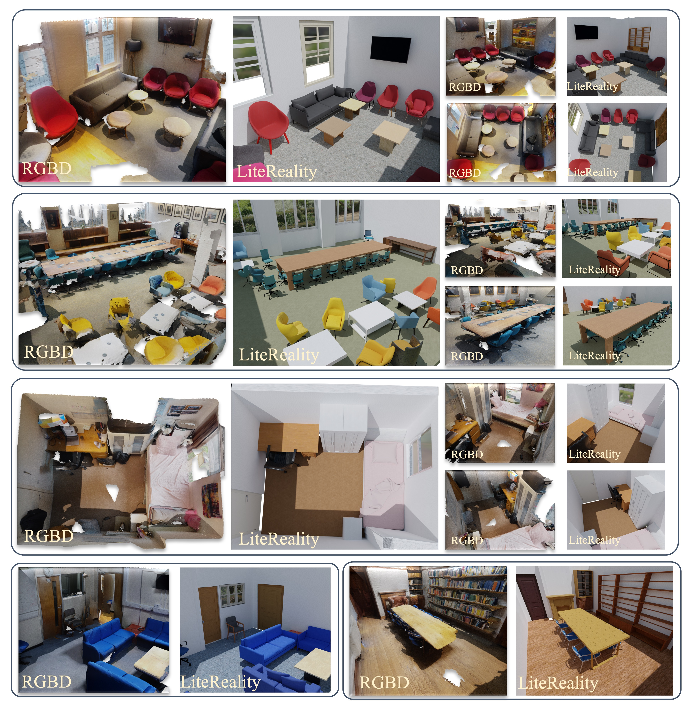

<h1 align="center">
  
  LiteReality: Graphics-Ready 3D Scene Reconstruction from RGB-D Scans
</h1>


<p align="center">
  <a href="https://arxiv.org/abs/2507.02861"></a>
  <a href="https://litereality.github.io"></a>
  <a href="https://www.youtube.com/watch?v=ecK9m3LXg2c&feature=youtu.be"></a>
</p>

<p align="center">
  <b><a href="https://zheninghuang.github.io/">Zhening Huang</a></b><sup>1</sup>,
  <b><a href="https://xywu.me">Xiaoyang Wu</a></b><sup>2</sup>,
  <b><a href="https://www.cl.cam.ac.uk/~fz261/">Fangcheng Zhong</a></b><sup>1</sup>,
  <b><a href="https://hszhao.github.io">Hengshuang Zhao</a></b><sup>2</sup>,
  <b><a href="https://www.niessnerlab.org/index.html">Matthias Nießner</a></b><sup>3</sup>,
  <b><a href="https://www.eng.cam.ac.uk/profiles/jl221">Joan Lasenby</a></b><sup>1</sup>
</p>
<p align="center">
  <sup>1</sup>University of Cambridge &nbsp; <sup>2</sup>The University of Hong Kong &nbsp; <sup>3</sup>Technical University of Munich
</p>

<p align="center">
  <a href="assets/LiteReality.jpg"></a>
</p>


## News

- <b>[2025-07-03]</b> Our paper is now available on <a href="https://arxiv.org/abs/2406.00000">arXiv</a>! 🚀, checkout the 🎬 [video demo](https://www.youtube.com/watch?v=ecK9m3LXg2c)  
- <b>Code will be released soon. Stay tuned!</b>


---

## Citation

If you find this project useful for your research, please cite:

```bibtex
@misc{huang2025literealitygraphicsready3dscene,
      title={LiteReality: Graphics-Ready 3D Scene Reconstruction from RGB-D Scans}, 
      author={Zhening Huang and Xiaoyang Wu and Fangcheng Zhong and Hengshuang Zhao and Matthias Nießner and Joan Lasenby},
      year={2025},
      eprint={2507.02861},
      url={https://arxiv.org/abs/2507.02861}, 
}
```
